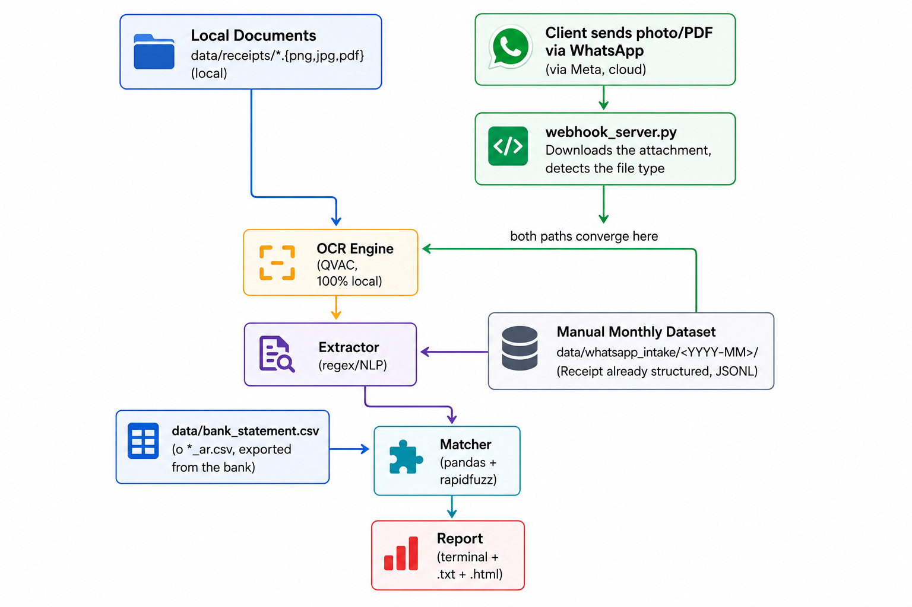

# AI Financial Reconciliation Agent

An agent for small accounting firms: it reconciles client receipts against bank statements and flags billing errors or fraud. OCR and matching run **100% locally** via QVAC — financial data never leaves the machine.

Built for the **Tether QVAC Track: Local agents for operations work**.



## The problem

Small accounting firms reconcile client receipts against bank statements by hand every month — hunting for duplicate charges, mismatched amounts, and unexplained bank fees. The data is sensitive (client financials, covered by professional confidentiality), so it can't be sent to a cloud LLM API. This agent automates the reconciliation while keeping all inference on-device.

## How it works

Receipts come in two ways — a local folder, or photos clients send over WhatsApp — and converge on the same pipeline:

```
receipts (folder or WhatsApp) → OCR (QVAC, local) → extractor → matcher (vs. bank CSV) → report (txt/html)
```

**Local, always:** OCR (QVAC vision model on-device), matching (pandas + RapidFuzz), report generation.
**Cloud-mediated:** only the WhatsApp intake path — attachments transit through Meta's WhatsApp Business API before reaching the local webhook. No other module makes network calls. If that's not acceptable, use the local-folder mode only.

## Quick start

```bash
python -m venv .venv && source .venv/bin/activate   # Windows: .venv\Scripts\activate
pip install -r requirements.txt

npm install -g @qvac/sdk@0.17.1
export QVAC_SDK_DIR="$(npm root -g)/@qvac/sdk"        # Windows: $env:QVAC_SDK_DIR = "$env:APPDATA\npm\node_modules\@qvac\sdk"

python scripts/generate_sample_data.py   # demo dataset: 21 receipts + bank_statement.csv
python main.py                           # runs OCR + reconciliation, writes reports/
```

Exits with code `2` if a CRITICAL discrepancy is found (useful for cron/CI). Key CLI flags: `--receipts-dir`, `--bank-csv`, `--whatsapp-month`, `--date-tolerance-days`, `--amount-tolerance`, `--merchant-threshold`, `--large-unmatched-amount`.

## Other ways to run it

- **`python main_web.py`** — local web UI (http://127.0.0.1:8080) for picking a receipt source and bank CSV without touching the CLI.
- **`python main_whatsapp.py`** — webhook server for real WhatsApp Business ingestion. Try `python scripts/simulate_whatsapp_traffic.py` first to see the flow without a Meta account.

## What the matcher flags

For each receipt: find bank transactions within a date window, fuzzy-match the merchant name, and compare amounts. Outcomes: clean match, `AMOUNT_MISMATCH`, `MISSING_IN_BANK`, `DUPLICATE_RECEIPT` (resubmitted receipt), or `UNACCOUNTED_CHARGE` (bank activity with no matching receipt). The matcher never guesses — low-confidence OCR reads get flagged for manual review instead of forced into a match.

## Project structure

```
main.py / main_whatsapp.py / main_web.py   # entry points
src/reconciliation_agent/
├── ocr_engine.py       # QVAC integration (the only inference layer)
├── extractor.py        # OCR text -> structured Receipt
├── bank_loader.py       # bank CSV -> normalized DataFrame
├── matcher.py           # reconciliation business logic
├── report.py / report_html.py
├── webapp.py            # local web UI
└── whatsapp/            # WhatsApp Business API ingestion
scripts/                 # sample data generators, WhatsApp traffic simulator
data/                    # sample receipts + bank statements (US and AR formats)
tests/
```

## Tests

```bash
pip install -r requirements-dev.txt
pytest
```

QVAC and the Meta API are mocked — no credentials or network needed.
